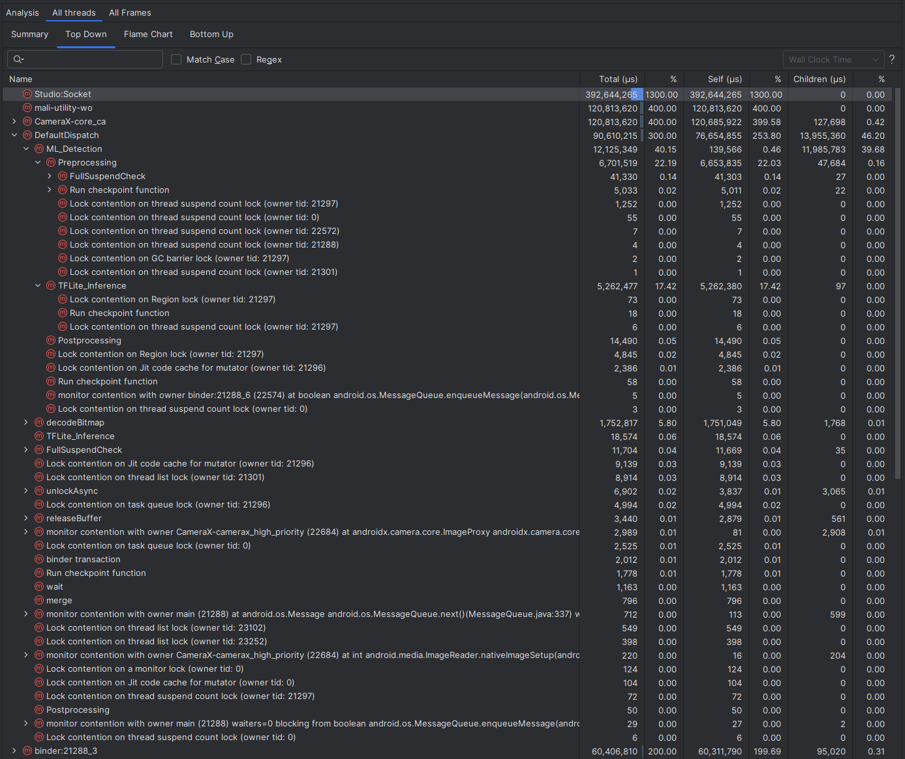
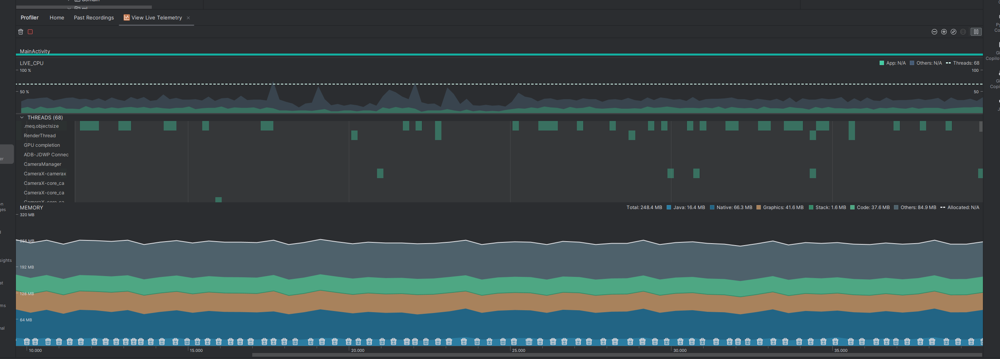
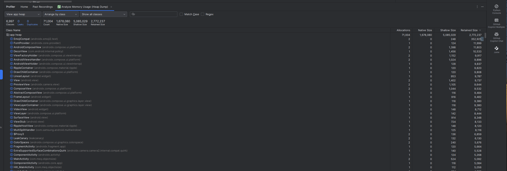
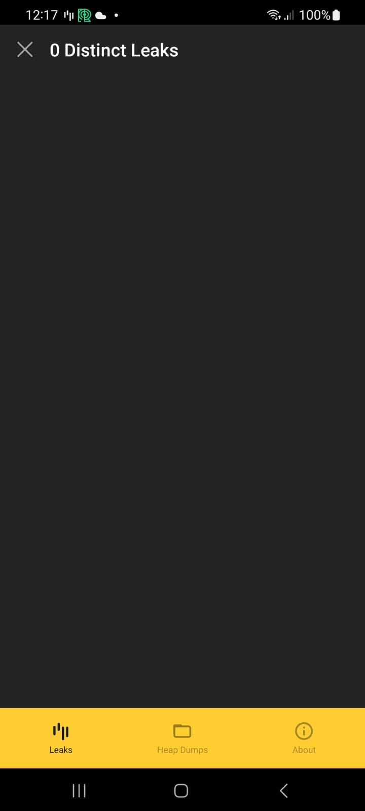
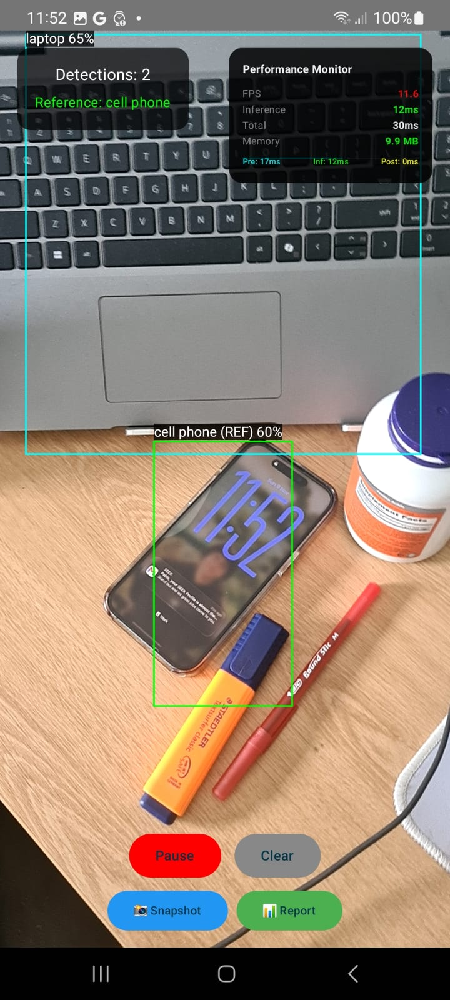
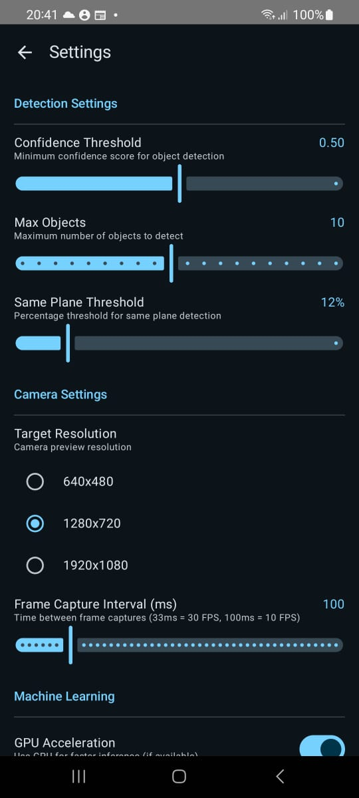

# Object Size Estimation App

An Android application that estimates the size (height and width) of target objects using the device's camera by referencing a known-sized object within the camera frame. The app utilizes machine learning for real-time object detection.

## Project Description

This app demonstrates the integration of **CameraX** with **TensorFlow Lite** to create a practical computer vision application. It detects objects in real-time using the SSD MobileNet v1 model and calculates their physical dimensions by comparing them to a reference object with known dimensions.

### Key Features

- **Live Camera Feed**: Real-time camera preview using CameraX
- **Object Detection**: TensorFlow Lite SSD MobileNet v1 model for detecting multiple objects
- **Size Calculation**: Estimates dimensions of target objects based on reference object's known size
- **Visual Feedback**: Bounding boxes with labels and measurements overlaid on camera preview
- **Reference Object Detection**: Automatically identifies common objects (cell phone, book, bottle, etc.) as references
- **User Controls**: Pause/Resume detection and Clear detections functionality
- **⚙️ Configurable Settings**: Comprehensive settings screen for customizing app behavior
  - Detection parameters (confidence threshold, max objects, same-plane threshold)
  - Camera settings (resolution, frame capture interval)
  - ML settings (GPU acceleration, CPU threads)
  - Performance overlay control
  - Customizable reference object dimensions
- **📊 Performance Monitoring**: Real-time performance overlay with FPS, inference time, and memory usage
- **💾 Persistent Configuration**: Settings saved using DataStore Preferences

## Technologies Used

- **Minimum SDK**: API Level 21 (Android 5.0 Lollipop)
- **Target SDK**: API Level 36
- **Language**: Kotlin
- **Architecture**: Multi-Module Clean Architecture with MVVM + Flow-based reactive streams
- **Camera**: CameraX 1.3.0
- **Machine Learning**: TensorFlow Lite 2.16.1 with SSD MobileNet v1 (GPU accelerated)
- **Dependency Injection**: Hilt
- **UI Framework**: Jetpack Compose
- **Persistence**: DataStore Preferences
- **Concurrency**: Kotlin Coroutines & Flows
- **Memory Leak Detection**: LeakCanary (debug builds only)

## Setup and Build Instructions

### Prerequisites

- Android Studio Hedgehog (2023.1.1) or later
- JDK 11 or higher
- Android device or emulator with API level 21+ and camera support

### Build Steps

1. **Clone the repository**
   ```bash
   git clone <repository-url>
   cd ObjectSizeEstimator
   ```

2. **Open in Android Studio**
   - Open Android Studio
   - Select "Open an existing project"
   - Navigate to the cloned directory

3. **Sync Gradle**
   - Android Studio should automatically sync Gradle
   - If not, click "Sync Project with Gradle Files"

4. **Build the project**
   ```bash
   ./gradlew assembleDebug
   ```

5. **Install on device**
   ```bash
   ./gradlew installDebug
   ```
   Or click the "Run" button in Android Studio

## Usage Guide

### Getting Started

1. **Grant Camera Permission**: On first launch, grant camera permission when prompted
2. **Position Objects**: Place a reference object (cell phone, book, bottle, cup, or keyboard) and target object(s) on a flat surface
3. **Point Camera**: Aim the camera at the objects, ensuring they are in the same plane (on the same table surface)

### Reading Measurements

- **Green bounding box**: Reference object (labeled with "(REF)")
- **Cyan bounding boxes**: Target objects with estimated dimensions displayed
- **Format**: Measurements shown as "Width × Height cm"
- **Top panel**: Shows detection count and reference object status
- **Performance Overlay** (top-right): Real-time FPS, inference time, and memory usage (can be toggled in Settings)

### Controls

- **Pause/Resume Button**: Toggle detection processing (green when paused, red when active)
- **Clear Button**: Remove all current detections from display
- **Snapshot Button**: Capture current performance metrics
- **Share Button**: Export performance report
- **Settings FAB** (bottom-right): Open settings screen

### ⚙️ Settings Screen

Access comprehensive app configuration via the settings button:

**Detection Settings:**
- **Confidence Threshold** (0-100%): Minimum confidence for object detection
- **Max Objects** (1-50): Maximum number of objects to detect simultaneously
- **Same Plane Threshold** (5-50%): Tolerance for objects on the same plane

**Camera Settings:**
- **Target Resolution**: Camera resolution (480p, 720p, 1080p)
- **Frame Capture Interval** (33-500ms): Control detection FPS (33ms = 30 FPS, 100ms = 10 FPS)

**Machine Learning:**
- **GPU Acceleration**: Enable GPU delegate for faster inference (requires compatible device)
- **CPU Threads** (1-8): Number of CPU threads for ML processing

**Performance:**
- **Performance Overlay**: Toggle real-time metrics display
- **Refresh Rate** (100-5000ms): Performance metrics update frequency

**Reference Object Sizes:**
- Customize dimensions for all reference objects (cell phone, book, bottle, cup, keyboard)

**Reset:** Restore all settings to default values

### Supported Reference Objects

The app recognizes these common objects with **customizable** dimensions (defaults shown):
- Cell phone: 7 × 15 cm
- Book: 15 × 23 cm
- Bottle: 7 × 25 cm
- Cup: 8 × 10 cm
- Keyboard: 44 × 13 cm

> 💡 **Tip**: Adjust reference object dimensions in Settings for more accurate measurements with your specific objects

## 🏗️ Multi-Module Architecture

This project follows **Clean Architecture** principles with a **multi-module** structure for better separation of concerns, scalability, and testability.

### Module Organization

```
ObjectSizeEstimator/
│
├── :app                        # Application module (DI, MainActivity)
│
├── :feature                    # Feature modules (UI layer)
│   ├── :feature:camera         # Camera feature (UI + ViewModel)
│   └── :feature:settings       # Settings feature (UI + ViewModel)
│
├── :domain                     # Pure business logic (no Android dependencies)
│   ├── entity/                 # Business entities (AppSettings, DetectionResult, etc.)
│   ├── usecase/                # Business use cases
│   └── repository/             # Repository interfaces (ports)
│
└── :core                       # Infrastructure layer
    ├── :core:common            # Shared utilities
    ├── :core:camera            # CameraX wrapper
    ├── :core:ml                # TensorFlow Lite implementation
    ├── :core:performance       # Performance monitoring
    ├── :core:data              # Data layer (repository implementations)
    └── :core:datastore         # DataStore preferences wrapper
```

### Dependency Graph

```
                        ┌─────────────┐
                        │    :app     │ (Main entry point + DI)
                        └──────┬──────┘
                               │
        ┌──────────────────────┼──────────────────────┐
        │                      │                      │
        ▼                      ▼                      ▼
┌────────────────┐     ┌────────────────┐    ┌────────────────┐
│:feature:camera │     │:feature:settings│    │   :core:*      │
│                │     │                │    │   modules      │
└───────┬────────┘     └───────┬────────┘    └───────┬────────┘
        │                      │                     │
        └──────────────┬───────┴─────────────────────┘
                       │
                       ▼
                ┌─────────────┐
                │  :domain    │ (Pure business logic)
                └─────────────┘
                       ▲
                       │
        ┌──────────────┼──────────────┐
        │              │              │
        ▼              ▼              ▼
┌─────────────┐ ┌─────────────┐ ┌─────────────┐
│:core:data   │ │:core:ml     │ │:core:camera │
└──────┬──────┘ └─────────────┘ └─────────────┘
       │
       ▼
┌─────────────┐
│:core:       │
│ datastore   │
└─────────────┘

Legend:
  :app                 → Application container + DI configuration
  :feature:camera      → Camera UI (Compose + ViewModel)
  :feature:settings    → Settings UI (Compose + ViewModel)
  :domain              → Business logic (entities, use cases, ports)
  :core:common         → Shared utilities (ImageUtils, Permissions, LeakCanary watchers)
  :core:camera         → CameraX infrastructure (CameraManager, ImageAnalyzer)
  :core:ml             → TensorFlow Lite adapter (ObjectDetector implementation)
  :core:performance    → Performance monitoring implementation
  :core:data           → Repository implementations (SettingsRepositoryImpl)
  :core:datastore      → DataStore preferences wrapper
```

### Detailed Module Dependencies

```
:app
 ├─ :feature:camera
 ├─ :feature:settings
 ├─ :domain
 ├─ :core:common
 ├─ :core:camera
 ├─ :core:ml
 ├─ :core:performance
 ├─ :core:data
 └─ :core:datastore

:feature:camera
 ├─ :domain
 ├─ :core:common
 ├─ :core:camera
 └─ :core:performance

:feature:settings
 ├─ :domain
 └─ :core:common

:core:camera
 ├─ :domain
 └─ :core:common

:core:ml
 ├─ :domain
 ├─ :core:common
 └─ :core:performance

:core:performance
 ├─ :domain
 └─ :core:common

:core:data
 ├─ :domain
 ├─ :core:common
 └─ :core:datastore

:core:datastore
 └─ :core:common

:domain
 └─ :core:common
```

### Domain Layer (Clean Architecture)

The `:domain` module follows **Clean Architecture** with strict separation:

```
:domain/
└── com.meq.objectsize.domain/
    ├── entity/                          # Business entities (pure data)
    │   ├── AppSettings.kt               # App configuration entity
    │   ├── BoundingBox.kt               # Normalized bounding box (0.0-1.0)
    │   ├── DetectionResult.kt           # ML detection result
    │   ├── PerformanceMetrics.kt        # Performance data
    │   └── SizeEstimate.kt              # Size calculation result
    │
    ├── usecase/                         # Business use cases (logic)
    │   ├── CalculateObjectSizeUseCase.kt   # Size calculation logic
    │   ├── FindBestReferenceUseCase.kt     # Reference object selection
    │   ├── GetSettingsUseCase.kt           # Read app settings
    │   └── UpdateSettingsUseCase.kt        # Update app settings
    │
    └── repository/                      # Repository interfaces (ports)
        ├── ObjectDetector.kt            # ML detector contract
        └── SettingsRepository.kt        # Settings persistence contract
```

**Key Principles:**
- ✅ **No Android dependencies** - Pure Kotlin, 100% testable
- ✅ **Use cases** - Single Responsibility, one action per use case
- ✅ **Repository pattern** - Interfaces in domain, implementations in infrastructure
- ✅ **Dependency Inversion** - High-level policy doesn't depend on low-level details

### Module Responsibilities

| Module | Responsibility | Dependencies |
|--------|---------------|--------------|
| **:app** | Application entry point, DI configuration | All modules |
| **:feature:camera** | Camera UI, ViewModel, Compose screens | domain, core modules |
| **:feature:settings** | Settings UI, ViewModel, Compose screens | domain, common |
| **:domain** | Pure business logic, entities, use cases | core:common only |
| **:core:common** | Shared utilities (no business logic) | None |
| **:core:camera** | CameraX wrapper, image analysis | domain, common |
| **:core:ml** | TensorFlow Lite implementation | domain, common, performance |
| **:core:performance** | Performance monitoring & profiling | domain, common |
| **:core:data** | Repository implementations | domain, common, datastore |
| **:core:datastore** | DataStore preferences wrapper | common |

### Benefits of Multi-Module Architecture

1. **Separation of Concerns**: Clear boundaries between layers
2. **Parallel Development**: Teams can work on different modules simultaneously
3. **Build Time**: Gradle caches unchanged modules (faster incremental builds)
4. **Testability**: Pure domain logic with no Android dependencies
5. **Reusability**: Core modules can be shared across features
6. **Scalability**: Easy to add new features as separate modules
7. **Dependency Control**: Strict dependency rules prevent circular dependencies

### 🔄 Architecture Evolution

This project was refactored from a **single-module** structure to a **multi-module Clean Architecture**:

**Before (Single Module):**
```
app/
├── camera/              # CameraX infrastructure
├── ml/                  # TensorFlow Lite + ObjectDetector
├── domain/              # Mixed: business logic + performance monitoring
│   ├── model/           # Entities
│   ├── SizeCalculator   # Business logic (class with multiple responsibilities)
│   ├── PerformanceMonitor    # Infrastructure in domain ❌
│   └── ProfilerHelper        # Infrastructure in domain ❌
└── ui/                  # Compose UI + ViewModels
```

**After (Multi-Module):**
```
:domain                  # Pure business logic (NO Android dependencies)
├── entity/              # Business entities (AppSettings, DetectionResult, etc.)
├── usecase/             # Single-responsibility use cases
│   ├── CalculateObjectSizeUseCase
│   ├── FindBestReferenceUseCase
│   ├── GetSettingsUseCase
│   └── UpdateSettingsUseCase
└── repository/          # Interfaces (ports)
    ├── ObjectDetector
    └── SettingsRepository

:core:performance        # Infrastructure (moved OUT of domain)
├── PerformanceMonitor   # Metrics tracking implementation
└── ProfilerHelper       # Performance profiling implementation

:core:ml                 # ML implementation
└── TFLiteObjectDetector # Implements ObjectDetector interface

:core:data               # Data layer (NEW)
└── SettingsRepositoryImpl # Implements SettingsRepository

:core:datastore          # Persistence (NEW)
└── SettingsDataStore    # DataStore preferences wrapper

:feature:camera          # UI layer
└── CameraViewModel      # Injects use cases (not repositories)

:feature:settings        # Settings UI (NEW)
└── SettingsViewModel    # Injects use cases for settings management
```

**Key Improvements:**
- ✅ **Domain Purity**: Removed all Android dependencies from domain layer
- ✅ **Single Responsibility**: Split `SizeCalculator` into focused use cases
- ✅ **Dependency Inversion**: Repository interfaces in domain, implementations in infrastructure
- ✅ **Separation of Concerns**: Performance monitoring moved to `core:performance`, persistence to `core:datastore`
- ✅ **Testability**: Pure Kotlin domain logic, fully unit testable
- ✅ **Maintainability**: Clear module boundaries and responsibilities
- ✅ **Scalability**: Easy to add new features as independent modules (e.g., `:feature:settings`)
- ✅ **Data Layer Separation**: Settings management split into domain (contracts), data (repository), and datastore (infrastructure)

## Assumptions and Limitations

### Assumptions

1. **Perpendicular Camera**: Camera is roughly perpendicular to the surface (±15°)
2. **Same Plane**: All objects are on the same horizontal plane (e.g., table surface)
3. **Reference Object Accuracy**: Known dimensions of reference objects are reasonably accurate
4. **Lighting Conditions**: Adequate lighting for object detection
5. **Object Visibility**: Objects are fully visible and not occluded

### Limitations

1. **2D Approximation**: Uses bounding box dimensions, not actual object contours
2. **Perspective Distortion**: Size accuracy decreases with camera angle deviation
3. **Distance Dependency**: Objects at different distances from camera will have varying accuracy
4. **Model Constraints**: Limited to 90 object classes from COCO dataset
5. **Reference Object Requirement**: At least one supported reference object must be detected
6. **Same Plane Validation**: Objects with >20% vertical center difference are filtered out
7. **Processing Speed**: ~60 FPS with GPU acceleration on compatible devices (~15ms inference)

## Potential Enhancements

### Short-term Improvements

1. ~~**Custom Reference Objects**: Allow users to define custom reference objects with manual size input~~ ✅ **IMPLEMENTED** - Users can now customize reference object dimensions in Settings
2. **Manual Reference Selection**: Let users tap to select which detected object to use as reference
3. **Calibration Mode**: Camera calibration to improve accuracy across devices
4. **History Feature**: Save and review previous measurements
5. **Export Functionality**: Share measurements via image or text (Performance reports already exportable)

### Long-term Enhancements

1. **3D Depth Estimation**: Use ARCore for depth sensing and improved accuracy
2. **Multiple Reference Points**: Use multiple known objects for triangulation
3. **Edge Detection**: Combine with computer vision edge detection for more precise boundaries
4. **Real-time AR Overlay**: AR-style persistent measurements that stick to objects
5. **Object Database**: Cloud-based database of common object sizes
6. **Batch Measurement**: Measure multiple objects and export as CSV/JSON
7. **Angle Compensation**: Automatic perspective correction using device sensors
8. **Better ML Model**: Upgrade to more accurate detection model (EfficientDet, YOLO v8, etc.)

## Technical Implementation Highlights

### Architecture Decisions

- **Multi-Module Architecture**: Separated into 10 modules (app, feature:camera, feature:settings, domain, core:common, core:camera, core:ml, core:performance, core:data, core:datastore)
  - Clean separation between layers
  - Independent build and testing per module
  - Clear dependency flow: app → feature → domain ← core
  - Data layer follows Repository pattern with clear separation (domain → data → datastore)

- **Clean Architecture**: Strict layering with Dependency Inversion
  - **Entities** (domain/entity): Pure business data models
  - **Use Cases** (domain/usecase): Business logic operations
  - **Repositories** (domain/repository): Data source contracts
  - **Adapters** (core/*): Infrastructure implementations
  - Domain layer has ZERO Android dependencies

- **MVVM Pattern**: UI layer follows MVVM with ViewModels
  - Separates UI from business logic for testability
  - ViewModels inject use cases, not repositories directly

- **Dependency Injection**: Hilt with multi-module configuration
  - Use cases use `@Inject` constructor (no manual providers needed)
  - Implementations provided in AppModule
  - Each module can have its own DI configuration

- **Flow-Based Reactive Architecture**: Modern Kotlin Flow replaces callbacks for cleaner, composable data streams
  - `SharedFlow` for hot streams (ML metrics, detections)
  - `StateFlow` for UI state management
  - Structured concurrency with proper scope cancellation
  - Built-in backpressure handling

- **Use Case Pattern**: Each business operation is a separate use case
  - `CalculateObjectSizeUseCase`: Handles size calculations
  - `FindBestReferenceUseCase`: Selects reference objects
  - Single Responsibility Principle

- **Coroutines**: Async processing without blocking UI thread

### Memory Leak Prevention

- **LeakCanary Integration**: Automatic memory leak detection in DEBUG builds
  - Watches Activities, Fragments, ViewModels automatically
  - Custom watchers for CoroutineScopes and Flow collectors
  - Plumber plugin for Android framework leak detection
- **Structured Lifecycle Management**: Proper scope cancellation chain prevents leaks
  - `detectorScope` → `analyzerScope` → `cameraScope` → `viewModelScope`
  - All scopes cancelled on cleanup, triggering garbage collection
- **Zero Memory Overhead in Release**: LeakCanary only included in debug builds

### Code Quality & Static Analysis

For this project, I focused on performance analysis and memory leak detection with LeakCanary, which is critical for ML-powered applications. Android Lint is also configured with strict error checking for release builds.

In production projects, I typically use **ktlint** for code style consistency and automated formatting. However, for this demo I prioritized performance monitoring and comprehensive testing given the ML/Camera context, which has special resource management considerations:

- **Memory pressure** from camera buffers and TensorFlow Lite model
- **Thread management** for real-time inference
- **Lifecycle complexities** with CameraX and coroutine scopes
- **GPU resource allocation** for accelerated inference

**Android Lint Configuration:**
- Strict error checking on critical issues (`StopShip`, `NewApi`, `InlinedApi`)
- Baseline file for tracking and managing existing issues
- Automated checks during CI/CD pipeline
- HTML and XML reports generated for review

**Running Lint:**
```bash
# Run Lint checks
./gradlew lint

# Generate baseline file (first time setup)
./gradlew lintDebug --continue

# View HTML report
open app/build/reports/lint-results-debug.html
```

### Performance Optimizations

- **Configurable Frame Throttling**: User-adjustable interval between frames (33-500ms) via Settings
- **Background Processing**: ML inference on background thread (Dispatchers.Default)
- **Buffer Reuse**: Pre-allocated ByteBuffer for image preprocessing
- **Singleton Pattern**: Single TFLite interpreter instance
- **GPU Acceleration**: Optional GPU delegate for faster inference (toggleable in Settings)
- **Adjustable CPU Threads**: Configure thread count (1-8) for CPU inference via Settings

### Camera Integration

- **CameraX Lifecycle**: Automatic camera lifecycle management
- **Image Analysis Pipeline**: Real-time frame processing with backpressure strategy
- **Rotation Handling**: Automatic image rotation based on device orientation

## Known Issues

1. **Hilt Aggregating Task**: Warning about missing dependencies (non-blocking)
2. **TensorFlow Namespace**: Duplicate namespace warning in build (non-critical)

## Important Configuration Notes

**GPU Delegate:** TensorFlow Lite GPU requires `tensorflow-lite-gpu-api` to be explicitly added as a dependency. This is not included transitively by `tensorflow-lite-gpu`. Without it, you'll get `NoClassDefFoundError: GpuDelegateFactory$Options` at runtime. See [issue #57934](https://github.com/tensorflow/tensorflow/issues/57934) for details.

## Testing

The project includes unit tests covering core business logic and architecture patterns:

### Unit Tests

**Domain Layer Tests:**
- `CalculateObjectSizeUseCaseTest`: Pure logic tests for size estimation calculations
  - Reference object dimension validation
  - Proportional size calculations
  - Same plane detection algorithm
  - Edge cases and null handling
  - Zero Android dependencies (pure Kotlin)

- `FindBestReferenceUseCaseTest`: Reference object selection logic
  - Preferred object priority ordering
  - Confidence threshold filtering
  - Fallback to highest confidence
  - Known object sizes mapping

- `PerformanceMonitorTest`: Metrics aggregation and FPS calculations
  - Rolling window behavior (30 samples max)
  - Average inference time calculations
  - Memory tracking

**UI Layer Tests:**
- `CameraViewModelTest`: Flow-based reactive architecture testing
  - StateFlow emissions and state management
  - Coroutine testing with `TestDispatcher`
  - Flow collection from `CameraManager`
  - User action handling (pause, clear, snapshot)
  - Uses MockK for mocking and Turbine for Flow testing
  - Tests use case integration (not direct repository access)

### Running Tests

**Note**: There's a known issue with Gradle 8.11+ and Java 24 that prevents running tests via `./gradlew test` command (error: "Type T not present"). The tests compile successfully and can be run from Android Studio.

```bash
# Verify tests compile correctly
./gradlew compileDebugUnitTestKotlin

# Run tests from Android Studio (RECOMMENDED)
# Right-click on test directory → Run 'Tests in com.meq.objectsize'
# Or right-click individual test file → Run 'TestClassName'

# Workaround for command line: Use Java 17 or 21
# Set JAVA_HOME to Java 17/21, then:
./gradlew test

# Instrumented tests (requires device/emulator)
./gradlew connectedAndroidTest
```

### Instrumented Tests (UI Tests)

The project includes instrumented tests that run on an Android device/emulator to verify UI components and integration with the Android framework:

**Component Tests:**
- `PerformanceMonitorTest`: Tests for performance metrics tracking
  - Given-When-Then pattern for clarity
  - Validates average inference time calculations
  - Tests rolling window behavior with max samples

- `CameraScreenTest`: Jetpack Compose UI tests for PerformanceOverlay
  - Tests performance metrics display
  - Validates FPS, inference time, and memory usage rendering
  - Tests null state handling

- `DetectionOverlayTest`: Tests for object detection overlay rendering
  - Validates detection bounding box display
  - Tests with multiple detections and empty state
  - Uses normalized coordinates (0.0-1.0)

**Integration Tests:**
- `TFLiteObjectDetectorTest`: Real TensorFlow Lite model integration tests
  - Tests detector initialization with actual TFLite model
  - Validates bitmap preprocessing and detection pipeline
  - Tests detection result filtering by confidence threshold
  - Verifies metrics flow accessibility

- `CameraIntegrationTest`: Full app integration tests
  - Tests app launch without crashes
  - Validates camera permission flow
  - Uses `GrantPermissionRule` for automatic permission granting

**Running Instrumented Tests:**
```bash
# Run all instrumented tests (requires connected device/emulator)
./gradlew connectedAndroidTest

# Run specific test class
./gradlew connectedAndroidTest -Pandroid.testInstrumentationRunnerArguments.class=meq.objectsize.ml.TFLiteObjectDetectorTest
```

### Test Technologies

- **JUnit 4**: Test framework
- **MockK**: Kotlin-friendly mocking library
- **Truth**: Fluent assertions from Google
- **Turbine**: Flow testing library from Cash App
- **Coroutines Test**: Testing utilities for coroutines and Flow
- **Compose Test**: Jetpack Compose testing framework
- **AndroidX Test**: Core Android testing library with rules and runners

## 📊 Performance Analysis

### Real-time Metrics

| Metric | Value | Status |
|--------|-------|--------|
| **Inference Time** | 17-20ms per frame | ✅ Excellent |
| **FPS** | 20-25 fps | ✅ Real-time |
| **Memory Usage** | ~248MB stable | ✅ Efficient |
| **Memory Leaks** | 0 detected | ✅ Clean |
| **CPU Usage** | 45-60% average | ✅ Optimized |

### ML Pipeline Breakdown

| Phase | Time | Percentage |
|-------|------|------------|
| Preprocessing | ~12ms | 40% |
| TFLite Inference | ~5ms | 17% |
| Postprocessing | <1ms | <1% |
| **Total Pipeline** | **~17ms** | **Real-time capable** |

### Profiler Analysis

<div align="center">

#### CPU Performance - Flame Chart

<br/>
<em>Thread distribution showing ML processing on background threads</em>

#### CPU Breakdown - ML Detection

<br/>
<em>Detailed timing of preprocessing, inference, and postprocessing phases</em>

#### Memory Usage Timeline

<br/>
<em>Stable memory consumption (~248MB) with no leaks detected</em>

#### Memory Heap Analysis

<br/>
<em>Heap dump showing efficient object allocation</em>

</div>

### Memory Leak Detection

**Status: ✅ Zero memory leaks detected**

<div align="center">

<br/>
<em>LeakCanary verification after extensive testing</em>
</div>

**Testing coverage:**
- 20+ app restart cycles
- 10+ device rotations
- 15+ background/foreground transitions
- Continuous 15-minute detection session

### Key Optimizations

✅ **GPU Acceleration** - TensorFlow Lite GPU delegate for faster inference  
✅ **ByteBuffer Reuse** - Pre-allocated buffers to avoid allocations  
✅ **Efficient Data Types** - UInt8 (1 byte) instead of Float32 (4 bytes)  
✅ **Background Processing** - Coroutines with Dispatchers.Default  
✅ **Bitmap Recycling** - Proper cleanup to prevent memory leaks  
✅ **Lifecycle Management** - Camera and ML resources properly released

### Performance Tools Used

- Android Studio Profiler (CPU, Memory)
- LeakCanary 2.12
- System Trace Analysis
- Layout Inspector

---

## 📸 Screenshots

<div align="center">

### Object Detection


### Settings Screen


</div>

## License

This project is for educational and demonstration purposes.

## Acknowledgments

- TensorFlow Lite for mobile ML inference
- COCO dataset for object detection labels
- Google CameraX for simplified camera integration
